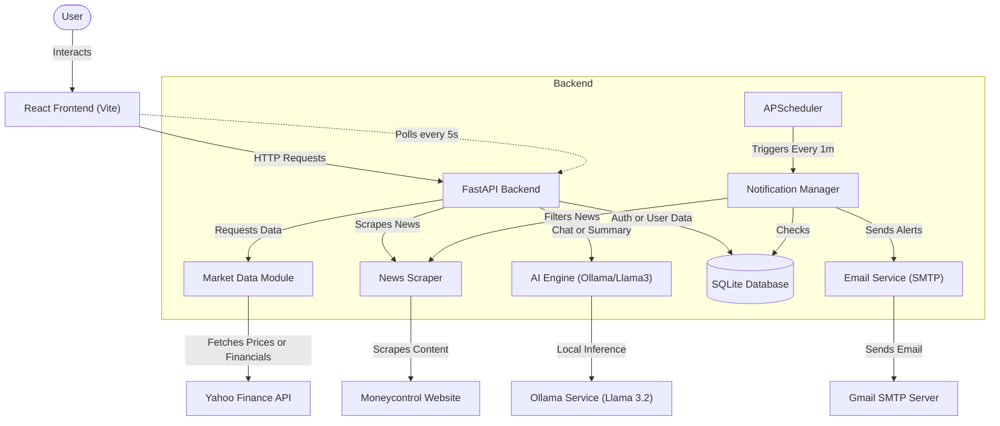

# MarketPulse AI

**An intelligent financial news aggregation and analysis platform powered by Local AI**

MarketPulse AI is a comprehensive web application that aggregates real-time financial news, performs sentiment analysis using FinBERT, uses local LLMs (Llama 3.2 via Ollama) for intelligent insights, and delivers personalized email notifications.

---

## 🎯 Problem Statement

In the fast-paced world of Indian stock markets, retail investors often face:
1.  **Information Overload**: Too many news sources, making it hard to filter relevant information.
2.  **Delayed Insights**: Critical news often reaches traders after the market has already reacted.
3.  **Lack of Sentiment Context**: Understanding whether a news piece is "Bullish" or "Bearish" requires deep financial literacy.
4.  **Fragmented Tools**: Investors switch between news apps, technical charting tools, and AI assistants.

**MarketPulse AI solves this** by providing a unified platform that aggregates real-time news, filters it based on your portfolio, analyzes sentiment using AI, and delivers instant alerts—all in one place.

---

## 🌟 How It Works: The "A to Z" Workflow

### 1. Data Ingestion (The Scraper)
*   **Source**: The system automatically scrapes financial news from **MoneyControl**.
*   **Process**:
    *   A background scraper runs periodically to fetch the latest news across 15+ categories (Economy, Stocks, IPOs, etc.).
    *   It extracts headlines, images, timestamps, and full article content.
    *   **Smart Caching**: Data is cached in `moneycontrol_news.json` to prevent excessive network calls and ensure fast load times.

### 2. Intelligent Analysis (The AI Engine)
Every piece of news goes through a multi-stage AI pipeline:
*   **Sentiment Analysis (FinBERT)**:
    *   As news is scraped, the **FinBERT** model (specialized for financial NLP) analyzes the headline and content.
    *   It assigns a sentiment label (**Positive**, **Negative**, or **Neutral**) and a confidence score.
*   **On-Demand Summarization (Llama 3.2)**:
    *   When a user clicks "Summarize" on an article:
        1.  The backend scrapes the specific article's full text.
        2.  It sends a prompt to the local **Ollama** instance running **Llama 3.2**.
        3.  The LLM generates a concise 100-word summary, stripping away noise, ads, and filler text.
*   **Dynamic Retrieval Augmented Generation (RAG)**:
    *   **Goal**: To answer factual questions about companies not in the model's training data.
    *   **Self-Learning Workflow**:
        1.  **Extraction**: The AI analyzes your query (e.g., "How did Dabur perform?") and identifies the ticker (`DABUR.NS`).
        2.  **Check & Fetch**: It checks the local **ChromaDB** vector store. If data is missing, it dynamically fetches the latest quarterly financials using `yfinance`.
        3.  **Ingest**: The data is chunked, embedded using `SentenceTransformers`, and stored for future use.
        4.  **Answer**: The chatbot retrieves this "fresh" context to provide an accurate, number-backed answer.

### 3. User Experience (The Frontend)
*   **Real-Time Feed**: Users see a paginated feed of news, sorted by recency.
*   **Filtering**:
    *   **Category**: Filter by "IPO", "Banking", "Economy", etc.
    *   **Watchlist ("For Me")**: A smart regex-based filter that only shows news relevant to stocks in the user's specific watchlist.
*   **Interaction**:
    *   **Ollama Chatbot**: A dedicated "Ask AI" chat interface where users can ask financial questions. The system prompt restricts the AI to **only** answer stock/finance-related queries, preventing hallucinations on non-relevant topics.

### 4. Background Notification System
*   **Scheduler**: A background job runs every **1 minute**.
*   **Matching Logic**:
    *   It loads the latest news and all user watchlists.
    *   It performs a strict keyword match (Stock Symbol & Company Name) against the news content.
    *   **Example**: If you have "RELIANCE" in your watchlist and a news headline says "Reliance Jio announces new tariff", the system flags it.
*   **Delivery**:
    *   It sends an effectively formatted **HTML Email** to the user using SMTP (Gmail).
    *   The email includes the article title, sentiment color-coded (Green for Positive, Red for Negative), and a brief snippet.

---

## 🌟 Key Features

### 🤖 Local AI & Ollama Integration
This project prioritizes privacy and cost-efficiency by using local LLMs.
*   **Engine**: **Ollama** (running locally on port 11434).
*   **Model**: **Llama 3.2** (optimized for instructions and summarization).
*   **Chatbot Guardrails**: The chatbot is engineered with a strict system prompt (`chatbot.py`) to declines non-financial queries (e.g., "tell me a joke") and strictly strictly adheres to financial context.

### 📧 Smart Email Notifications
Never miss a market-moving update.
*   **Duplicate Prevention**: The system tracks sent articles in the database to ensure you never get the same alert twice.
*   **Rich Content**: Emails contain sentiment indicators and direct links to the source.

### 📊 Frontend Experience (React + Vite)
*   **Disclaimer Modal**: A "Welcome" modal ensures users understand the educational nature of the tool.
*   **Dashboard**: A responsive grid layout featuring:
    *   **Market Indices**: Real-time ticker.
    *   **News Feed**: Infinite scroll/pagination.
    *   **Stock Details**: Interactive charts using **Recharts**.
*   **Dark Mode**: Native support for dark/light themes.

---

## 🏗️ Technology Stack

### Backend
*   **Framework**: FastAPI (Python)
*   **Database**: SQLite (with SQLAlchemy ORM)
*   **AI/ML**:
    *   **Ollama (Llama 3.2)**: Chat & Summarization.
    *   **FinBERT**: Sentiment Analysis (Hugging Face).
    *   **RAG Pipeline**:
        *   **Vector DB**: ChromaDB (Locally persistent).
        *   **Embeddings**: `sentence-transformers/all-MiniLM-L6-v2`.
        *   **Orchestration**: Custom Dynamic Ingestion Engine.
*   **Scheduling**: APScheduler (Background tasks).
*   **Email**: SMTP (Google Mail).

### Frontend
*   **Framework**: React 19 (Vite).
*   **Styling**: Tailwind CSS 4.
*   **Visualization**: Recharts.
*   **Icons**: Lucide React.

---

## 🚀 Getting Started

### Prerequisites
1.  **Ollama**: Download from [ollama.com](https://ollama.com) and install.
2.  **Pull Model**: Run `ollama pull llama3.2` in your terminal.
3.  **Python 3.10+**
4.  **Node.js 18+**

### Installation

#### 1. Backend Setup
```bash
cd backend

# Create Virtual Environment
python -m venv venv
# Windows
.\venv\Scripts\activate
# Mac/Linux
source venv/bin/activate

# Install Dependencies
pip install -r requirements.txt

# Configure Environment
# Create a .env file with your specific variables (see .env.example if available)
# Required for Email:
# SMTP_EMAIL=your_email@gmail.com
# SMTP_PASSWORD=your_app_password

# Run Server
python main.py
```
*Server starts at `http://localhost:8000`*

#### 2. Frontend Setup
```bash
cd frontend

# Install Dependencies
npm install

# Run Development Server
npm run dev
```
*App opens at `http://localhost:5173`*

---

## 📁 Project Structure

```
MarketPulseAI-main/
├── backend/
│   ├── main.py                 # API Entry Point & Scheduler
│   ├── chatbot.py              # Ollama Integration & Prompts
│   ├── notification_manager.py # Email Notification Logic
│   ├── email_service.py        # SMTP Handling
│   ├── scraper.py              # MoneyControl Scraper
│   ├── sentiment.py            # FinBERT Model Loader
│   └── database.py             # SQLite Models
│
├── frontend/
│   ├── src/
│   │   ├── components/         # Reusable UI (Modals, Cards)
│   │   ├── pages/              # Dashboard, StockDetails, Auth
│   │   └── context/            # Global State
│   └── public/                 # Assets
│
└── README.md
```

---

## 🏗️ System Architecture & Workflow

This diagram illustrates how data flows from external sources through our backend pipeline to the user interface.



### 🧩 Component Breakdown

#### 1. Frontend (User Interface)
*   **Technology**: React.js + Vite + Tailwind CSS.
*   **Role**: Displays the dashboard, real-time ticker, and news feed.
*   **Interaction**: It polls the backend every **5 seconds** for silent updates on market indices (Nifty/Sensex) and news.
*   **AI Chat**: Sends user queries to the backend, which forwards them to the local LLM.

#### 2. Backend (The Brain)
*   **Technology**: FastAPI (Python).
*   **Role**: Orchestrates all services. It exposes endpoints for:
    *   `/news`: Fetched from the scraper or cache.
    *   `/market`: Real-time data from Yahoo Finance.
    *   `/chat`: Context-aware responses from Ollama.
    *   `/stock/{symbol}/financials`: Quarterly results data.

#### 3. Data Pipeline & Scraper
*   **Technology**: BeautifulSoup4 + Requests.
*   **Role**: Automatically scrapes **MoneyControl** for the latest financial news.
*   **Caching**: News is cached in a JSON file to reduce latency and avoid hitting external rate limits.

#### 4. AI Engine (Local Intelligence)
*   **Components**: 
    *   **Ollama (Llama 3.2)**: Handles summarization and the Q&A chatbot. Running locally ensures data privacy and zero API costs.
    *   **FinBERT**: A specialized BERT model running in the backend to tag every news article with sentiment (Positive/Negative/Neutral).

#### 5. Notification System
*   **Technology**: APScheduler + SMTP.
*   **Workflow**:
    1.  Runs every **1 minute**.
    2.  Checks specific keywords in your **Watchlist** against new articles.
    3.  If a match is found (and not sent previously), it triggers an HTML email alert via Gmail SMTP.

---

## 🛡️ Disclaimer
This application is for **educational purposes only**. The financial information provided by the AI models and sentiment analysis should not be taken as professional investment advice. Always do your own research.

---

## 👨‍💻 Team
*   **Prashant Gupta**
*   **Aniruddha Dawkhare**
*   **Yashodhan Agashe**
*   **Ayushi Punde**
*   **Rujali Nagbhidkar**
*   **Priyanka Mankar**
